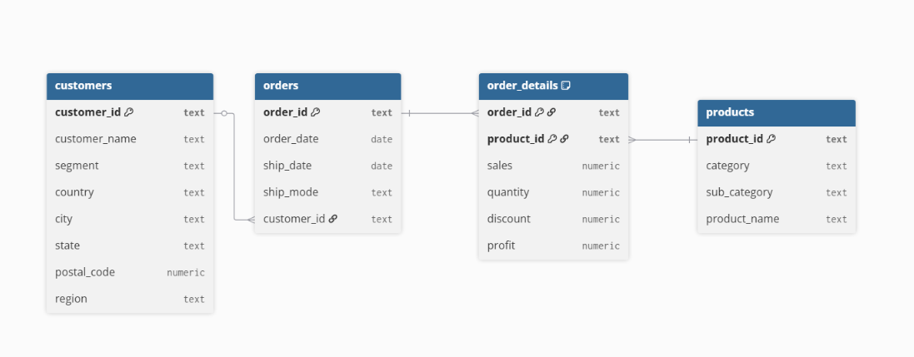

# Superstore Analytics

## 📌 Overview
This project analyzes sales and profitability using the **Superstore dataset**.  
The goal is to understand sales performance, profitability, and customer trends using **PostgreSQL** and **Power BI**.

## 📊 Dataset
- **Source:** Superstore sample dataset (public, used widely in BI training)
- **Size:** ~10,000 rows (this repo includes the file used for this project: `superstore.csv`)
- **Privacy:** Public, no sensitive information

## ⚙️ Tools
- PostgreSQL
- SQL (CTEs, window functions, aggregates, joins)
- Power BI (dashboards & KPIs)

## ❓ Key Business Questions
1. Which are the total sales per product?
2. Which product categories and subcategories drive the most profit?
3. How do sales trends by category?
4. how YoY growth by sales and profit have changed over the years based on product´s category?
5. What customer segments and region combined are most valuable?

## 📂 Repository Structure
- `sql/` → database schema, load script, and analysis queries
- `docs/` → sample dataset, ERD
- `images/` → screenshots of dashboards (power BI) and queries results (PGadmin)
- `README.md` → project summary and instructions

## 🚀 How to Reproduce
1. Create a new PostgreSQL database:
The way i did it was directly in PGadmin, in the workspace (the menu at the left) there is the Server section which is localy in my PC, then right-click on databases and create - database, then put the name in this case superstore and click save.

2. Creating queries at the Query tool workspace (the second icon in the left menu) and start creating tables and importing data, the script i used are in the sql folder as follow:
   sql/SCHEMA.sql

3. Then i created another query workspace so i dont mix queries from the schema into analysis .. does can be found at sql/Analysis.sql

## Database Schema & ERD

The data is normalized into these tables:

- `customers` (customer info + region etc.)  
- `orders` (order-level info)  
- `products` (product catalog)  
- `order_details` (line-item level: sales, quantity, profit etc.)

**Relationships:**

- Each `order` links to one customer.  
- `order_details` links orders to products (many-to-many through that table).  

**Entity Relationship Diagram (ERD):**

